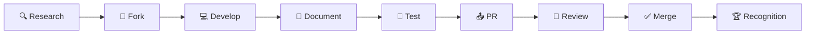

# 🛡️ SecVulnHub

<div align="center">

```
███████╗███████╗ ██████╗██╗   ██╗██╗   ██╗██╗     ███╗   ██╗██╗  ██╗██╗   ██╗██████╗ 
██╔════╝██╔════╝██╔════╝██║   ██║██║   ██║██║     ████╗  ██║██║  ██║██║   ██║██╔══██╗
███████╗█████╗  ██║     ██║   ██║██║   ██║██║     ██╔██╗ ██║███████║██║   ██║██████╔╝
╚════██║██╔══╝  ██║     ╚██╗ ██╔╝██║   ██║██║     ██║╚██╗██║██╔══██║██║   ██║██╔══██╗
███████║███████╗╚██████╗ ╚████╔╝ ╚██████╔╝███████╗██║ ╚████║██║  ██║╚██████╔╝██████╔╝
╚══════╝╚══════╝ ╚═════╝  ╚═══╝   ╚═════╝ ╚══════╝╚═╝  ╚═══╝╚═╝  ╚═╝ ╚═════╝ ╚═════╝ 
```

### ⚡ **WHERE ETHICAL HACKERS FORGE DIGITAL WEAPONS** ⚡

<p align="center">
  
  
  
  
</p>

<p align="center">
  
  
  
  
  
</p>

---

```diff
@@                                                                                 @@
@@  "In the realm of cybersecurity, we don't just find vulnerabilities—          @@
@@              we craft the tools that reveal them."                             @@
@@                                                                                 @@
```

</div>

---

## 🎯 **MISSION STATEMENT**

<table>
<tr>
<td width="50%">

### 🔥 **THE VISION**

SecVulnHub isn't just another GitHub repo—it's a **living arsenal** where battle-tested security tools are forged, refined, and deployed by practitioners who live and breathe offensive security.

**We believe in:**
- 🎯 Quality over quantity
- ⚔️ Tools built in the trenches
- 🌐 Open-source excellence
- 🛡️ Ethical hacking standards

</td>
<td width="50%">

### ⚡ **THE DIFFERENCE**

```python
class SecVulnHub:
    def __init__(self):
        self.quality = "battle-tested"
        self.docs = "crystal-clear"
        self.team = "active-hunters"
        self.mission = "forge-the-future"
    
    def philosophy(self):
        return "Build tools practitioners trust"
```

**Every tool undergoes:**
- ✅ Real-world testing
- ✅ Security audit
- ✅ Documentation review
- ✅ Community validation

</td>
</tr>
</table>

---

## 🏴‍☠️ **WHO BUILDS THIS ARSENAL**

<div align="center">

### 💀 **THE COLLECTIVE** 💀

*A team of cybersecurity obsessives who build tools that matter*

</div>

<table>
<tr>
<td align="center" width="25%">
<br/>
<sub><b>Advanced Pentesting</b></sub><br/>
<sub>Red Team Operations</sub><br/>
<sub>Attack Simulation</sub>
</td>
<td align="center" width="25%">
<br/>
<sub><b>Active Hunters</b></sub><br/>
<sub>HackerOne | Bugcrowd</sub><br/>
<sub>Critical CVEs</sub>
</td>
<td align="center" width="25%">
<br/>
<sub><b>0day Discovery</b></sub><br/>
<sub>Novel Attack Vectors</sub><br/>
<sub>Responsible Disclosure</sub>
</td>
<td align="center" width="25%">
<br/>
<sub><b>Full Stack</b></sub><br/>
<sub>Automation Masters</sub><br/>
<sub>Workflow Integration</sub>
</td>
</tr>
</table>

---

## 🚀 **THE 100-DAY GAUNTLET**

<div align="center">

### ⚔️ **100 DAYS • 20 TOOLS • INFINITE IMPACT** ⚔️

</div>

```
┌─────────────────────────────────────────────────────────────────────┐
│  START: June 10, 2025 - 12:45 EAT                                  │
│  CADENCE: 1 Tool Every 5 Days                                       │
│  GOAL: Build The Ultimate Ethical Hacking Toolkit                   │
└─────────────────────────────────────────────────────────────────────┘
```

<table>
<tr>
<td width="20%" align="center">
<br/>
<b>🔍 RECON</b><br/>
<sub>Intelligence Gathering</sub><br/>
<sub>Target Profiling</sub><br/>
<sub>Attack Surface Mapping</sub>
</td>
<td width="20%" align="center">
<br/>
<b>🛡️ DETECTION</b><br/>
<sub>Vulnerability Scanners</sub><br/>
<sub>Assessment Tools</sub><br/>
<sub>Multi-Platform Support</sub>
</td>
<td width="20%" align="center">
<br/>
<b>⚔️ EXPLOITATION</b><br/>
<sub>PoC Frameworks</sub><br/>
<sub>Exploitation Aids</sub><br/>
<sub>Authorized Testing</sub>
</td>
<td width="20%" align="center">
<br/>
<b>🤖 AUTOMATION</b><br/>
<sub>Workflow Integration</sub><br/>
<sub>Operation Streamlining</sub><br/>
<sub>Productivity Boost</sub>
</td>
<td width="20%" align="center">
<br/>
<b>🔬 ANALYSIS</b><br/>
<sub>Forensics Tools</sub><br/>
<sub>Incident Response</sub><br/>
<sub>Advanced Analytics</sub>
</td>
</tr>
</table>

---

## 🗡️ **THE ARSENAL**

<div align="center">

### 🔥 **CHOOSE YOUR WEAPON** 🔥

</div>

<details open>
<summary></summary>

<br/>

| Tool | Description | Status |
|------|-------------|--------|
| **🎯 Port Scanner Plus** | Advanced port enumeration + service fingerprinting |  |
| **🌐 Subdomain Hunter** | Comprehensive subdomain discovery & validation |  |
| **📡 DNS Enum Suite** | Deep DNS analysis + zone transfer detection |  |
| **🕵️ OSINT Gatherer** | Automated open-source intelligence collection |  |
| **🗺️ Network Mapper** | Advanced network topology discovery |  |

</details>

<details>
<summary></summary>

<br/>

| Tool | Description | Status |
|------|-------------|--------|
| **💥 Web Fuzzer Pro** | Intelligent fuzzing + payload optimization |  |
| **⚙️ Config Auditor** | Systematic configuration security analysis |  |
| **🔐 SSL/TLS Scanner** | Comprehensive certificate & protocol testing |  |
| **📝 CMS Vuln Scanner** | Specialized content management system testing |  |
| **🔌 API Security Tester** | REST/GraphQL API security validation |  |

</details>

<details>
<summary></summary>

<br/>

| Tool | Description | Status |
|------|-------------|--------|
| **💉 XSS Payload Gen** | Context-aware cross-site scripting testing |  |
| **🗄️ SQL Injection Tester** | Advanced database injection techniques |  |
| **🎫 CSRF Token Analyzer** | Cross-site request forgery validation |  |
| **🔀 Param Pollution** | HTTP parameter manipulation testing |  |

</details>

<details>
<summary></summary>

<br/>

| Tool | Description | Status |
|------|-------------|--------|
| **🧬 Payload Generators** | Custom payload creation for various vectors |  |
| **🔄 Reverse Shell Kit** | Multi-platform reverse connection utilities |  |
| **⬆️ PrivEsc Checker** | Automated privilege escalation enumeration |  |

</details>

<details>
<summary></summary>

<br/>

| Tool | Description | Status |
|------|-------------|--------|
| **🤖 APK Analyzer** | Comprehensive Android app security testing |  |
| **🍎 iOS Security Tester** | iPhone application vulnerability assessment |  |
| **📡 Mobile API Interceptor** | Mobile application traffic analysis |  |

</details>

<details>
<summary></summary>

<br/>

| Tool | Description | Status |
|------|-------------|--------|
| **📊 Log Analyzer** | Intelligent log parsing + anomaly detection |  |
| **🧠 Memory Dump Parser** | Advanced memory analysis + artifact extraction |  |
| **🔍 Traffic Analyzer** | Deep packet inspection + protocol analysis |  |

</details>

<details>
<summary></summary>

<br/>

| Tool | Description | Status |
|------|-------------|--------|
| **🎯 Scanner Orchestrator** | Multi-tool integration framework |  |
| **📄 Report Generator** | Automated security assessment reporting |  |
| **🔔 Notification System** | Real-time security event alerting |  |

</details>

<details>
<summary></summary>

<br/>

| Tool | Description | Status |
|------|-------------|--------|
| **🔓 Hash Cracker** | Multi-algorithm hash breaking utilities |  |
| **🔄 Encoding Decoder** | Universal encoding/decoding toolkit |  |
| **🎭 Payload Encoder** | Advanced payload obfuscation techniques |  |

</details>

---

## 🤝 **JOIN THE FORGE**

<div align="center">

### 🔨 **BECOME A WEAPONSMITH** 🔨

</div>

We're looking for **elite contributors** who share our obsession with building tools that matter.

<table>
<tr>
<td width="50%">

### ✅ **WHAT WE ACCEPT**

```yaml
contribution:
  quality:
    - solves_real_problem: true
    - battle_tested: true
    - production_ready: true
  
  documentation:
    - deploy_in: "< 5 minutes"
    - clarity: "crystal clear"
    - examples: "comprehensive"
  
  code:
    - security: "audited"
    - tests: "passing"
    - standards: "enforced"
```

</td>
<td width="50%">

### 📋 **SUBMISSION CHECKLIST**

- [ ] **Solves real cybersecurity challenge**
- [ ] **5-minute deployment from docs**
- [ ] **Passes security audit**
- [ ] **Includes comprehensive tests**
- [ ] **Follows directory structure**
- [ ] **Has install.sh + test.sh**
- [ ] **Works across environments**
- [ ] **Adds unique value to arsenal**

</td>
</tr>
</table>

### 🔥 **CONTRIBUTION PROCESS**



---

## ⚖️ **ETHICAL USE ONLY**

<div align="center">

```
╔═══════════════════════════════════════════════════════════════════╗
║                                                                   ║
║  ⚠️  WITH GREAT TOOLS COMES GREAT RESPONSIBILITY  ⚠️              ║
║                                                                   ║
║  Every utility in SecVulnHub is designed for AUTHORIZED,         ║
║  ETHICAL cybersecurity operations ONLY.                          ║
║                                                                   ║
╚═══════════════════════════════════════════════════════════════════╝
```

</div>

<table>
<tr>
<td width="33%" align="center">

### ✅ **AUTHORIZED USE**

Legitimate pentesting<br/>
Security research<br/>
Defensive operations<br/>
Educational purposes<br/>
<sub>**Always get permission**</sub>

</td>
<td width="33%" align="center">

### 🔐 **RESPONSIBLE DISCLOSURE**

Follow disclosure practices<br/>
Report vulnerabilities<br/>
Protect affected parties<br/>
Coordinate with vendors<br/>
<sub>**Be a responsible researcher**</sub>

</td>
<td width="33%" align="center">

### ⚖️ **LEGAL COMPLIANCE**

Know your local laws<br/>
Understand regulations<br/>
Respect privacy laws<br/>
Follow ethical guidelines<br/>
<sub>**You are responsible**</sub>

</td>
</tr>
</table>

---

## 📊 **LIVE STATS**

<div align="center">

### 🔥 **ARSENAL METRICS** 🔥


</div>

---

## 🏆 **HALL OF FAME**

<div align="center">

### ⚡ **CONTRIBUTOR RECOGNITION** ⚡

</div>

<table>
<tr>
<td align="center" width="25%">

**🥇 LEGENDARY**

Contributors with 10+ tools

<sub>Permanent attribution</sub><br/>
<sub>Legendary badge</sub><br/>
<sub>Leadership opportunities</sub>

</td>
<td align="center" width="25%">

**🥈 ELITE**

Contributors with 5-9 tools

<sub>Profile highlighting</sub><br/>
<sub>Elite badge</sub><br/>
<sub>Priority PR review</sub>

</td>
<td align="center" width="25%">

**🥉 VETERAN**

Contributors with 2-4 tools

<sub>Repository attribution</sub><br/>
<sub>Veteran badge</sub><br/>
<sub>Community recognition</sub>

</td>
<td align="center" width="25%">

**⭐ CONTRIBUTOR**

Contributors with 1 tool

<sub>Tool credit</sub><br/>
<sub>Contributor badge</sub><br/>
<sub>Community access</sub>

</td>
</tr>
</table>

---

## 📞 **COMMUNICATIONS**

<div align="center">

| Channel | Purpose | Link |
|---------|---------|------|
| 🐛 **Issues** | Bug reports & feature requests | [Open Issue](../../issues) |
| 💬 **Discussions** | General questions & ideas | [Join Discussion](../../discussions) |
| 🔒 **Security** | Vulnerability reports | security@secvulnhub.local |
| 📖 **Docs** | Documentation & guides | [Read Docs](docs/) |

</div>

---

<div align="center">

## 🌟 **OUR PROMISE** 🌟

```
┌─────────────────────────────────────────────────────────────────┐
│                                                                 │
│  "We're not just building tools—                               │
│   we're forging the future of ethical cybersecurity."          │
│                                                                 │
│  Built by practitioners.                                       │
│  Tested in the field.                                          │
│  Trusted by professionals.                                     │
│                                                                 │
└─────────────────────────────────────────────────────────────────┘
```

---

### 🛡️ **SecVulnHub** • *Where Digital Security is Crafted* • 🛡️


---

**⭐ Star this repo if you believe in ethical hacking done right**

**🔱 Fork it if you're ready to contribute to the arsenal**

**👁️ Watch for updates as we build the future of cybersecurity tools**

</div>

---

<div align="center">

**Made with 💀 by hackers, for hackers**

*Last Updated: October 2025*

</div>
